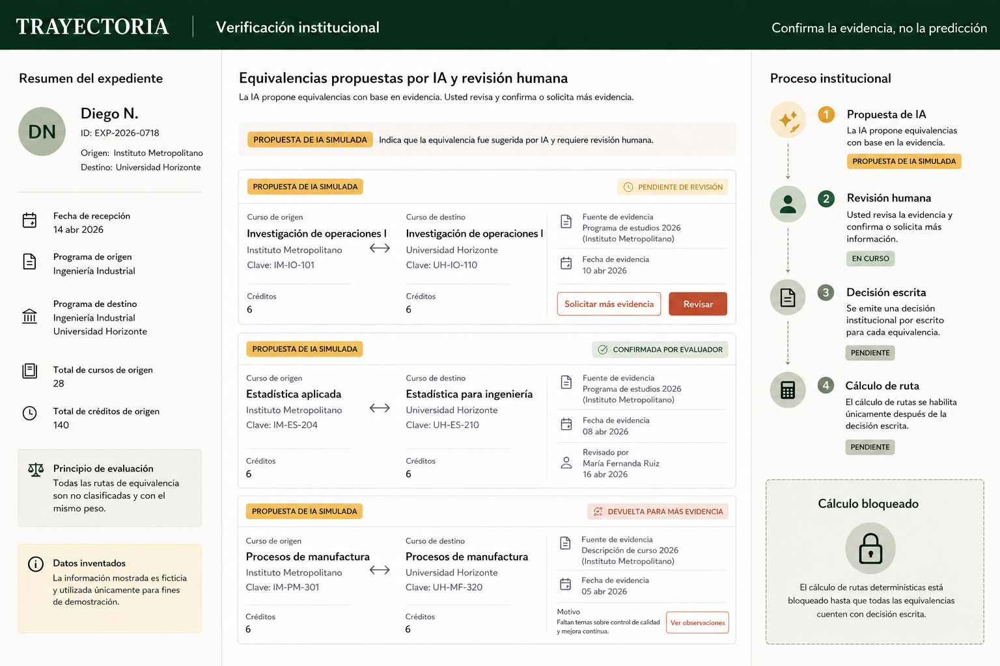
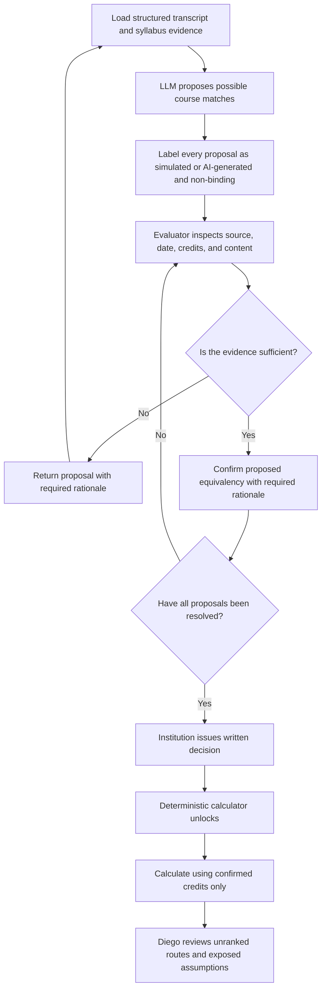
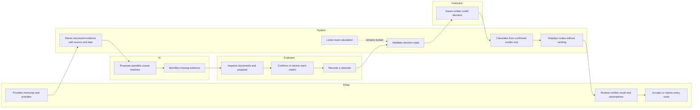

# Trayectoria - Week 4 Product Packet

**Working slice:** Evaluator-verification workflow  
**Role:** Technologist  
**Author:** David Buzali  
**Status:** Packet before code  

## 1. Problem in my words

Diego cannot safely compare university-transfer routes because course equivalencies are uncertain and institutional decisions often arrive after enrollment or payment deadlines. AI can identify possible matches, but treating those suggestions as verified credits could distort cost, completion-time, and affordability calculations. The difficult technology is therefore not course comparison alone; it is a verification workflow that turns a machine suggestion into inspectable institutional evidence before any route calculation is allowed to act.

## 2. Exact user

The operational user is an authorized university course-equivalency evaluator in a small participating Mexican transfer network. This person reviews transcript and syllabus evidence, confirms or returns proposed course matches, records a rationale, and issues a written institutional decision.

Diego is the beneficiary and final decision-maker. He is a fictional 20-year-old, first-generation Industrial Engineering student whose family is stretching its finances to pay tuition. No real student, evaluator, university, transcript, or financial information will appear in the prototype.

## 3. Success definition

> Before the module closes, an authorized evaluator can inspect the source, evidence date, and reasoning behind each AI-proposed course match; confirm or return every proposal; and issue a written institutional decision. The deterministic route calculator remains locked until that decision is issued and then uses confirmed credits only.

The slice is successful when all of the following are true:

- Three fictional course-equivalency proposals load from structured data.
- Every proposal is visibly labeled as an AI suggestion and non-binding.
- The evaluator can inspect the source, date, credits, syllabus evidence, and missing information.
- Confirming or returning a proposal requires an evaluator rationale.
- Returned courses never count toward the route calculation.
- The institutional decision cannot be issued while any proposal is unresolved.
- The route calculator cannot run before the written decision exists.
- The result displays facts and assumptions without ranking institutions or predicting Diego's future.

## 4. Image-generated mockup



The mockup is intentionally a single working surface rather than a complete platform. It shows Diego's fictional case, three course decisions, evidence provenance, a four-stage institutional process, and a calculator that remains visibly locked until a written decision exists.

## 5. Feature flow



## 6. Actor swimlane

More than one actor touches this process, so the packet separates the responsibilities of Diego, the system, the AI, the evaluator, and the institution.



## 7. Benchmark

**The best existing solution on Earth for this is Transferology.** It turns institution-maintained course-equivalency data into searchable transfer results for participating institutions and students.

**Mine differs and localizes by beginning with a small Mexican institutional network in which AI may propose equivalencies, but an authorized evaluator must issue a written, traceable decision before the student's payment deadline; routes remain unranked.**

Transferology demonstrates the value of publishing institutional equivalencies, but its student experience sorts schools by match percentage. Trayectoria deliberately rejects that ranking mechanic because the Blueprint requires equal visual weight and prohibits hidden judgments about a student's future.

Mexico's SERE already supports formal online equivalency and revalidation requests and delivers official resolutions. Trayectoria should complement rather than replace that infrastructure. The narrower hypothesis is that a participating institution can expose course-level evidence and produce a usable written decision early enough to support a student's pre-enrollment choice.

Sources:

- [CollegeSource: Transferology product overview](https://collegesource.com/transfer-tools/transferology/)
- [Transferology: how course-transfer searches work](https://transferology-support.collegesource.com/article/51-how-to-use-will-my-courses-transfer)
- [SEP: Sistema de Equivalencia y Revalidacion de Estudios](https://sere.sep.gob.mx/login.jsp)
- [Diario Oficial: Acuerdo 16/04/25 establishing SERE](https://sidof.segob.gob.mx/notas/docFuente/5756774)
- [SEP: public RVOE consultation system](https://sirvoes.sep.gob.mx/sirvoes/mvc/consultas)

## 8. Three-year light charter

In three years, Trayectoria could become a small but trusted Mexican transfer-decision network in which participating institutions maintain current equivalencies, costs, schedules, and deadlines. Students could compare reversible educational routes using written institutional evidence while preserving their preferred path and controlling what information they share. The product would remain a decision-support and accountability layer - never a ranking system, admission authority, or predictor of human potential.

## 9. Blueprint conditions and shadow clause

The slice will honor the team's conditions in the following visible ways:

| Blueprint condition | How the slice honors it |
| --- | --- |
| Provenance and verification | Every course proposal displays its source, evidence date, credits, status, and responsible evaluator. |
| No destiny or employability score | The data model contains no score, ranking, admission prediction, or lifetime-outcome field. |
| Open-future firewall | Diego's current path remains visible; alternatives receive equal visual weight; assumptions remain inspectable; Diego may reject every route. |
| Immediate stability | The calculated view distinguishes documented costs from unconfirmed support. No unawarded scholarship or financing counts as available money. |
| User control | The prototype explains what information is used, permits correction in the workflow, and previews the result before any external handoff. |
| Bounded pilot | The demo uses one fictional case, one fictional destination institution, three course proposals, and no production integration. |

The shadow is that a personalized system could convert Diego's temporary financial constraints into a judgment that he should lower his educational ambition. Trayectoria therefore cannot hide an ambitious path merely because it is currently unaffordable. When a route exceeds a declared constraint, the interface must expose the gap and any verified support that would change the result; unconfirmed support remains a next step, not available money.

## 10. Scope cut

This working slice will not include:

- A nationwide university network.
- Real students, transcripts, institutions, evaluators, or RVOE records.
- Admission applications or the final legal equivalency procedure.
- University rankings, match-percentage scores, or a "best option" label.
- Predictions of academic performance, employability, income, or life outcomes.
- Payments, loans, or live scholarship applications.
- Automatic AI approval of course equivalencies.
- Institution-to-institution messaging.
- Production document uploads or permanent personal-data storage.
- The complete economic pilot, cash-protection engine, first-cohort operation, or adversarial test owned by other team members.

The slice implements only this load-bearing sequence:

> Structured evidence -> AI proposal -> evaluator decision -> written institutional confirmation -> deterministic calculation.

## 11. Architecture

### State boundary

The core workflow is a small explicit state machine:

```text
evidence_loaded -> proposal_ready -> under_review -> all_resolved -> decision_issued -> calculation_available
```

No interface action may skip a state. AI output can create or annotate a proposal, but only an evaluator action can change a proposal to `confirmed` or `returned`, and only an issued institutional decision can unlock calculation.

### Stack table

| Layer | Choice | Why it fits this slice |
| --- | --- | --- |
| Interface | React, TypeScript, and the existing Next/Vinext project | Supports a responsive interactive surface without introducing another framework. |
| Structured data | Typed fictional fixtures stored as TypeScript objects or JSON | Makes sources, dates, credits, statuses, and actors inspectable and testable without storing personal data. |
| LLM layer | Server-side endpoint returning a strict structured proposal | Keeps the API key out of the browser and limits the model to proposing matches and missing evidence. |
| Demo fallback | Fixed simulated proposals, visibly labeled on screen | Keeps the live demo usable if the external model is unavailable while making the simulation explicit. |
| Validation | Allowlisted course IDs, strict output schema, type checks, and short rationale limits | Prevents raw input from flowing directly into a prompt or workflow state. |
| Verification logic | Pure reducer/state-machine functions | Makes the human-approval boundary deterministic and mechanically testable. |
| Route calculation | Pure deterministic function using confirmed credits only | Prevents the LLM from changing costs, credit totals, or completion estimates. |
| Persistence | No permanent storage in this academic slice | All demo data is fictional and session-local, so authentication and a personal-data database are unnecessary. |
| Future persistence | Supabase Auth plus Row Level Security, only if real user records are introduced | Satisfies the security floor before any personal data is stored. |
| Deployment | Existing free-tier web deployment workflow | Produces the required live URL without a paid infrastructure dependency. |
| Tests | Node test runner plus documented browser task checks | Covers deterministic rules and the complete evaluator journey with minimal tooling. |

### Structured-data contract

Each proposal will contain only bounded, inspectable fields:

```ts
type CourseProposal = {
  id: string;
  sourceCourseId: string;
  targetCourseId: string;
  sourceDocument: string;
  evidenceDate: string;
  sourceCredits: number;
  targetCredits: number;
  contentEvidence: string[];
  missingEvidence: string[];
  aiExplanation: string;
  status: "pending" | "confirmed" | "returned";
  evaluatorRationale?: string;
  evaluatorName?: string;
  decidedAt?: string;
};
```

The contract intentionally excludes socioeconomic proxies, personality judgments, recommendation scores, admission probabilities, and predictions. The model may propose `aiExplanation` and `missingEvidence`; it may not write the final `status`, evaluator identity, institutional decision, or calculated result.

### LLM boundary

The server sends the model only the fictional structured course records needed for the selected proposal. The model returns candidate course IDs, a concise evidence-based explanation, and missing-evidence flags in a validated schema. Invalid, oversized, or out-of-set output is rejected. The interface labels model output as non-binding, and model failure never unlocks the calculator or silently converts a proposal into an institutional decision.

## 12. Security floor

- No API key or secret will appear in source code, screenshots, seed data, or Git history; any key will exist only in the deployment environment.
- The prototype will store no real personal data and will label every person, institution, record, and decision as fictional.
- Because the slice has no persistent personal records, it does not need authentication. Authentication and Row Level Security become prerequisites before any production persistence is added.
- Every evaluator rationale will be trimmed, required, and limited to 240 characters.
- Requests will accept allowlisted record IDs rather than raw transcript text from a free-form field.
- The LLM response will be schema-checked before it can appear in the workflow.
- AI output will never be trusted as authorization to confirm a course, issue a decision, or run the calculator.

## 13. Test plan

### Pass 1: mechanical testing

| Test | Expected result |
| --- | --- |
| Load the fictional case | Three proposals appear with sources, dates, credits, and visible AI labels. |
| Try to confirm without a rationale | The action is blocked and an accessible validation message appears. |
| Enter more than 240 rationale characters | The input is rejected or bounded without changing state. |
| Return one proposal | Its status becomes returned and its credits are excluded. |
| Leave one proposal pending | The institutional-decision action remains disabled. |
| Resolve all proposals | The decision action becomes available, but the calculator remains locked. |
| Issue the written decision | The decision receives a timestamp and the calculator unlocks. |
| Run the calculation | Only confirmed credits affect the total; returned credits never appear. |
| Simulate an invalid LLM response | The proposal is rejected safely and the human gate remains locked. |
| Search rendered output and data schema | No ranking, best-option label, admission probability, or forbidden proxy field appears. |
| Keyboard-only and narrow-screen check | The complete evaluator task remains understandable and operable. |
| Secret and demo-data check | No key or real person's information appears in the repository or deployed interface. |

The mechanical pass must uncover and document at least one actual defect. After fixing it, the site will be rebuilt and redeployed; the original problem, correction, and result will be recorded in `docs/TESTING.md`.

### Pass 2: synthetic persona test

The persona will be an evaluator rather than a general student because the evaluator is the operational user of this slice:

> You are Laura, 43, a university course-equivalency analyst who processes many requests through email, PDFs, and spreadsheets. You are careful about institutional liability, skeptical of AI suggestions, pressed for time, and unwilling to approve anything when the source or authority is unclear. Attempt the task as Laura, narrating where you hesitate, what you distrust, and where you would stop.

In a fresh LLM conversation, screenshots will be presented in task order. The persona will attempt to inspect a proposal, return one, confirm the others, issue the institutional decision, and explain why the calculator unlocked. Every confusion will be logged, and the highest-risk confusion will be fixed before the final deployment. The persona, transcript summary, confusion log, chosen fix, and evidence after the fix will be recorded in `docs/PERSONA.md` and exported as `PERSONA_davidbuzali.pdf`.

## 14. Build and deployment checkpoints

The implementation prompt will divide the work into at least five reviewable commits:

1. Packet, structured-data contract, and test skeleton.
2. Evaluator workspace and fictional evidence cards.
3. Decision validation and human-review state machine.
4. Written-decision gate and deterministic route calculator.
5. Mechanical test fix, persona-test fix, accessibility polish, and final documentation.

The first deployment will occur after the complete evaluator flow works with fictional structured data. The second deployment will occur only after the mechanical test exposes a defect and that defect is fixed. Additional commits or deployments may be added when a change is independently meaningful.

## 15. Final product boundary

This prototype tests one institutional claim: whether an explicit AI-proposes / human-confirms / calculator-waits workflow can produce a more trustworthy pre-enrollment transfer decision. It does not test whether AI can choose Diego's future. Diego retains the right to inspect the evidence, preserve his preferred path, reject every route, and decide what happens next.
